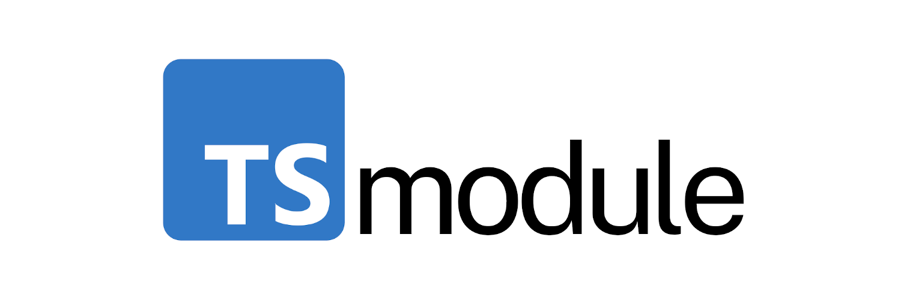

<div align="center">
  
  <h1>TypeScript Module Toolkit</h1>
</div>

TSModule is a toolkit for developing pure ESM TypeScript packages that target any platform (browser, Node, etc.). 

**Table of contents**

<!-- toc -->

- [Purpose](#purpose)
  * [Create ESM packages using TypeScript](#create-esm-packages-using-typescript)
  * [Develop projects in real-time](#develop-projects-in-real-time)
  * [Build to optimized ES modules](#build-to-optimized-es-modules)
    + [Optimizing NPM dependencies with `-b, --bundle`](#optimizing-npm-dependencies-with--b---bundle)
  * [Run TypeScript directly](#run-typescript-directly)
- [Installation](#installation)
    + [Requirements](#requirements)
    + [Existing projects](#existing-projects)
    + [New projects](#new-projects)
- [Use Cases](#use-cases)
  * [Generic TypeScript library](#generic-typescript-library)
  * [React component library (using Next.js)](#react-component-library-using-nextjs)
- [Footnotes](#footnotes)
  * [Module configuration](#module-configuration)
    + [Package.json export](#packagejson-export)
- [License](#license)

<!-- tocstop -->

## Purpose

### Create ESM packages using TypeScript

```shell
$ tsmodule create [--react]
```

**Rady out of the box:**

  - package.json scripts
  - TypeScript, ESLint, Tailwind configs
  - CI/CD with GitHub Actions

### Develop projects in real-time

Build in dev mode and watch for changes:

```shell
$ tsmodule dev
```

### Build to optimized ES modules

```shell
$ tsmodule build [--bundle]
```

**All projects:**

  - Emit pure ESM, no polyfilling to CJS
  - Emit ESNext by default, no polyfilling to older feature sets

**React projects created with `create --react`:**

  - Bundle CSS by default
  - Use Tailwind by default

#### Optimizing NPM dependencies with `-b, --bundle`

With `-b, --bundle` mode, all entry points are compiled "in-place" and runtime NPM dependencies will generally not be needed as they will be inlined. If you build in bundle mode, you can move your dependencies to devDependencies, as the only thing that will be needed to run any/all compiled-in-place entry point(s) in your module are the bundles themselves.

TSModule itself builds with `-b, --bundle` flag, and requires only two runtime NPM dependencies:

1. `esbuild`, which does the heavy lifting for the build process, does not allow itself to be bundled
2. `typescript`, so TSModule can use the built `tsc` binary to generate `.d.ts` type declarations during builds

### Run TypeScript directly

```shell
$ tsmodule file.ts
```

  - Uses Node module loader to resolve TS at runtime
  - Executable TypeScript files with `#!/usr/bin/env tsmodule`

## Installation

### Requirements

Because TS modules are pure ESM environments, **Node 14+** is required.

### Existing projects

Add TSModule with:

```shell
$ yarn add -D @tsmodule/tsmodule
```

Then add a build script to your package.json, and call it with `yarn build`:

```json
"scripts": {
  "build": "tsmodule build"
}
```

Source will be compiled from `src/` to `dist/`.

### New projects

Use `tsmodule create [--react] project-name` to create a new project.

## Use Cases

Below are some example use cases of TS modules in practice.

### Generic TypeScript library

The most common type of library will be a TS module with generic TypeScript
exports in `src/**/index.ts`, e.g.
[`await-shell`](https://github.com/ctjlewis/await-shell), a Promise wrapper
around `child_process.spawn` that's used in tsmodule itself.

This library contains only one export, at `src/index.ts` (a function called
`shell`), but you could import e.g. `import { test } from "my-package/path/to/export"` by exporting that identifier at `src/path/to/export/index.ts`.

### React component library (using Next.js)

`tsmodule create --react` creates a TS module which is also a Next app; pages are in `src/pages`, and components are in `src/components`. Tailwind, PostCSS, and `postcss-import` are all supported by default.

CSS will be bundled from `src/components/index.css` and exported at `my-package/styles`, which the package.json `style` field also points to (for `postcss-import` support), so that components packages are modular.


  ```json
  {
    "style": "./dist/bundle.css",
    "exports": {
      ".": "./dist/index.js",
      "./*": "./dist/components/*/index.js",
      "./styles": "./dist/bundle.css",
      "./styles/*": "./dist/styles/*/index.css",
      "./package.json": "./package.json"
    },
  }
  ```

To use a component downstream, import the styles into the page, e.g.:

```tsx
// src/pages/_app.tsx
import "my-package/styles";
```

Or in CSS (resolved by `postcss-import` using `"style"` field in package.json):

```css
@import "my-package";
```

And render your component:

```tsx
// src/pages/test.tsx
import { MyComponent } from "my-package";

export default function TestPage() {
  return (
    <MyComponent />
  );
}
```

## Footnotes

### Module configuration

All packages built with `tsmodule build` are ES modules. `{ "type": "module" }`
is forced to minimize ambiguity.

`tsmodule build` also forces the following tsconfig.json values during the
type-check and declaration emit:

```json
{
  "rootDir": "src/",
  "outDir": "dist/",
}
```

And conditional exports in package.json will be configured like so, such that
"index modules" at e.g. `src/test/index.ts` will be available at
`my-package/test`:

```json
{
  "files": ["dist/"],
  "exports": {
    "./package.json": "./package.json",
    "./": "./dist/index.js",
    "./*": "./dist/*/index.js"
  },
}
```

This has no restriction on internal imports between files, only the default
configuration for how downstream consumers can import from module subpaths.

#### Package.json export

For information on why the `"./package.json": "./package.json"` export is
specified, see [#1](https://github.com/tsmodule/tsmodule/issues/1#issuecomment-1065500448).

## License

MIT © [C. Lewis](https://ctjlewis.com)